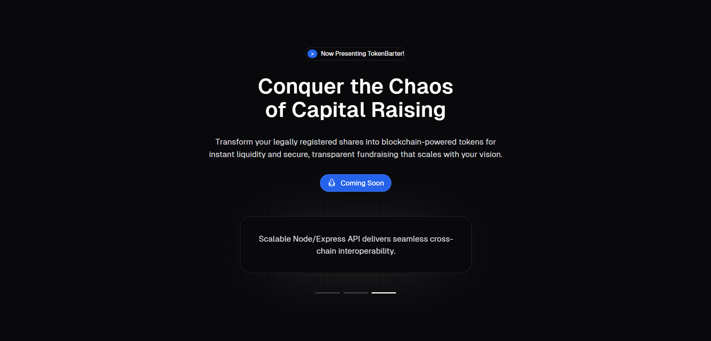

<h1>TokenBarter</h1>

[Visit TokenBarter Live](https://token-barter.netlify.app/)

A modern platform for tokenizing company shares on the blockchain, built with security and compliance in mind.



## Technologies

TokenBarter is built using a robust stack of modern technologies:

- **Frontend**: React.js, Next.js for server-side rendering and optimized performance.
- **Backend**: Node.js with Express for RESTful API services.
- **Database**: MongoDB for scalable and flexible data storage.
- **Blockchain**: Solidity for smart contracts, Hardhat for Ethereum development environment.
- **Testing**: Mocha and Chai for backend testing, Jest for frontend testing.
- **Version Control**: Git for source code management.

## Features 

* Blockchain-Powered Security
* Instant Liquidity
* Fully Customizable
* Regulatory Compliant
* Smart Contract Integration
* Real-time Trading

## Build Setup

```bash
# install dependencies
$ npm install
# serve with hot reload at localhost:3000
$ npm run dev
# build for production and launch server
$ npm run build
# preview production
$ npm run preview
```

## Documentation
* [Security](https://docs.tokenbarter.io/security/) to learn about our security measures and smart contract implementation.
* [API](https://docs.tokenbarter.io/api/) to understand how to integrate with our platform.
